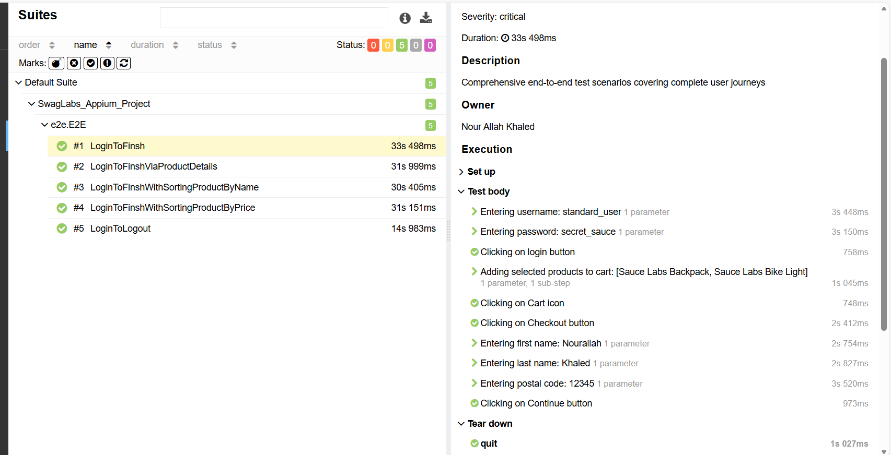

# 📱 SwagLabs Mobile Automation Project using Appium 
This project demonstrates how to automate the SwagLabs mobile application using **Appium**. 
It includes test scripts for various functionalities of the app, such as login, product browsing, adding items to the cart, checkout, overview, and logout.

- **APK Download:** https://github.com/saucelabs/sample-app-mobile/releases
- **Used Version:** Android.SauceLabs.Mobile.Sample.app.2.7.1.apk
---
## ⭐ Key Features

-  End-to-End mobile automation for SwagLabs Android app
-  Clean architecture using Page Object Model (POM)
-  Dynamic driver management with Appium service handling
-  Reusable actions layer for mobile gestures and interactions
-  Data-driven testing using JSON files
-  Detailed Allure reports with screenshots and logs
-  Parallel execution support with thread-safe drivers
-  Centralized logging using Log4j
-  CI/CD integration using GitHub Actions
-  Automatic screenshot capture on test failure

---
## ✅ Key Technologies
- **Java** – programming language used for writing tests.
- **Appium** – mobile automation framework for Android and iOS.
- **Selenium WebDriver** – for interacting with UI elements.
- **TestNG** – test execution and reporting framework.
- **Maven** – dependency management and project build.
- **Android Studio / Xcode** – for emulators and device management.
- **Appium Inspector** – for locating elements and inspecting the app.
- **Log4j** – logging library for debugging and tracking.
- **Page Object Model (POM)** – design pattern for maintainable tests.
- **Git** – version control.
- **GitHub Actions** – CI/CD workflow automation for running tests automatically.
---
## 🏛️ Framework Components

| Component / Layer              | Responsibility                                                                            |
|:-------------------------------|-------------------------------------------------------------------------------------------|
| **Driver Management**          | Handles mobile driver initialization and management using Factory pattern (`AndroidDriver`). |
| **Configuration Loader**       | Loads test configs and environment data from `.properties` & `JSON` files.                |
| **Data Reader**                | Reads test data from external sources (JSON, properties).                                 |
| **Page Objects**               | Implements the Page Object Model (POM) for modular and maintainable test scripts.         |
| **Actions Layer**              | Contains reusable methods for UI interactions (clicks, input, scrolling, gestures).       |
| **Assertion Layer**            | Wraps TestNG assertions with custom Hard/Soft assertion handlers.                         |
| **Listeners & Reporting**      | Integrates TestNG listeners and Allure for detailed HTML reporting with screenshots.      |
| **Parallel Execution**         | Supports parallel test runs via TestNG and Thread-safe AndroidDriver handling.            |
| **Cross-Platform Support**     | Executes tests on multiple devices/emulators and OS versions based on config.             |
| **CI/CD Pipeline**             | GitHub Actions workflow for automated test execution and reporting.                       |
---
## 🌐 Starting Appium Server

This project supports two ways to start the Appium server.

> ⚠️ **Note:** For regular test execution, you do **not** need to manually start the server. The server and session are handled automatically in the code.

#### 1️⃣ Automatically from Code (Recommended)

The `DriverManager` class starts the Appium server and opens the session automatically:

- `startDriver()` will start the Appium server (if `executionType` is `"local"`) and create the `AndroidDriver` session.
- The server uses the IP and port specified in `appiumServerUrl` in your configuration (default port `4723`).
- After tests finish, `quitDriverAndService()` will stop both the driver and the Appium server.

> ✅ This is the recommended approach for automation and CI/CD.

#### 2️⃣ Manually from Command Line (Optional)
- You can also start the Appium server manually using the command line.
- Use the command above to start the server on port `4723` with CORS allowed.
- Make sure the server is running before executing tests if you choose this method.

 ```bash
   appium -p 4723 --allow-cors
 ```
---
## 🔍 Appium Inspector
You can use Appium Inspector to locate elements and inspect the SwagLabs mobile app. Here are the connection settings:
Before starting the session, make sure the Appium server session is running.
```bash
appium -p 4725 --allow-cors
```
Then use the following desired capabilities in Appium Inspector:
- **Platform Name:** Android
- **Platform Version:** (Your device/emulator version)
- **Device Name:** (Your device/emulator name)
- **Automation Name:** UiAutomator2
- **App Path:** (Path to the SwagLabs APK file)
- **App Activity:** com.swaglabsmobileapp.MainActivity
- **Appium Server URL:** http://127.0.0.1
- **Appium Server Port:** 4725

> ⚠️ After entering the capabilities, start the session to inspect the app elements, and you can control navigating through the app using the android studio emulator.
---
## 📂 Project Structure 
```plaintext
SwagLabs_Appium_Project/
|
├───.github
│   └───workflows
│   │      └─── Run E2E Pipeline.yml
│   │       
├───.idea
├───.mvn
├───src
│   ├───main
│   │   ├───java
│   │   │   └───com.swaglabs
│   │   │           ├───android
│   │   │               └─── AndroidFactory.java
│   │   │               └─── DriverManager.java
│   │   │           ├───assertions
│   │   │                └─── BaseAssertion.java
│   │   │                └─── HardAssertion.java
│   │   │                └─── SoftAssertion.java      
│   │   │           ├───datareader
│   │   │                └─── JsonReader.java
│   │   │                └─── PropertyReader.java
│   │   │           ├───listeners
│   │   │                └─── TestNGListeners.java      
│   │   │           ├───media
│   │   │                └─── ScreenShotMedia.java    
│   │   │           ├───pages
│   │   │                └─── Page01_Login.java
│   │   │                └─── Page02_Home.java
│   │   │                └─── Page03_ProductDetails.java
│   │   │                └─── Page04_AddToCart.java
│   │   │                └─── Page05_CheckOut.java
│   │   │                └─── Page06_Overview.java
│   │   │                └─── Page07_Finish.java
│   │   │           └───utils
│   │   │                └─── AllureUtil.java
│   │   │                └─── TimeManager.java
│   │   │                └─── WaitManager.java
│   │   │                ├─── actions
│   │   │                      └─── ElementAction.java
│   │   │                      └─── MobileAndroidAction.java      
│   │   │                ├─── logs
│   │   │                      └─── LogsManager.java      
│   │   │                   
│   │   └───resources
│   │   │        └─── allure.properties
│   │   │        └─── enviroment.properties
│   │   │        └─── log4j2.properties
│   │   │        └─── META-INF
│   │   │               └───services
│   │   │                    └─── org.testng.ITestNGListener
│   │   │                
│   └───test
│   │   └───java
│   │   │   ├───e2e
│   │   │   │    └─── E2E.java
│   │   │   │       
│   │   │   ├───resources
│   │   │   │      └─── Android.SauceLabs.Mobile.Sample.app.2.7.1.apk
│   │   │   │   │   
│   │   │   │   └───Test_Data
│   │   │   │        └─── Test_data.json
│   │   │   │           
│   │   │   └───tests
│   │   │   │     └─── BaseClass.java
│   │   │   │     └─── TC01_Login.java
│   │   │   │     └─── TC02_Home.java
│   │   │   │     └─── TC03_ProductDetails.java
│   │   │   │     └─── TC04_AddToCart.java
│   │   │   │     └─── TC05_CheckOut.java
│   │   │   │     └─── TC06_Overview.java
│   │   │   │     └─── TC07_Finish.java
│   │   │   │       
├───target
│               
└───Test-out
│   ├───allure-report
│   │    └─── index.html
│   ├───allure-results
│   └───Logs
└─── test_result_screen
│   └─── LoginToFinish_screen.png
└───.gitattributes
└───.gitignore
└───E2E.xml
└───generate-allureReport.bat
└───pom.xml
└───README.md
```
---
## 🚀 How to Run Tests

### 1️⃣ Run Locally

1. Make sure your Android device/emulator is ready and the SwagLabs app is installed.
2. Ensure `environment.properties` is configured correctly, for example: 
    - executionType= `local`
    - platformName= `Android`
    - deviceName= `TestEmulatorApp`
    - androidAutomationName= `UiAutomator2`
    - androidAppPath= `src/test/java/resources/Android.SauceLabs.Mobile.Sample.app.2.7.1.apk`
    - androidAppActivity= `com.swaglabsmobileapp.MainActivity`
    - appiumServerUrl= `http://127.0.0.1:4723`
3. Open a terminal in the project root and run:
- For Run E2E Tests 
```bash
   mvn clean test -Dtest="E2E"
```
- For Run Specific Test Case (e.g., TC01_Login)
```bash
  mvn clean test -Dtest="TC01_Login"
```
After execution, generate the Allure report using:
   - The Report generated automatically via cmd file then copy the link to browser.

### ⚡ Run via GitHub Actions CI/CD Pipeline
1. Push your code changes to the GitHub repository.
2. The GitHub Actions workflow (`Run E2E Pipeline.yml`) will trigger automatically on pushes to the `main` branch.
3. The workflow will set up the environment, install dependencies, and execute the tests.
4. After completion, the workflow will generate and upload the Allure report as an artifact.
5. You can download and view the Allure report from the Actions tab in your GitHub repository.
---
## 🖼️ Test Report Screen
- After test execution, detailed HTML reports are generated using **Allure**.
- Reports include test steps, statuses, screenshots, and logs for easy debugging.
### 📊 Login to Finish Flow


---

## 💁‍♀  ️Author

🌸 **Nour Allah Khaled** 🌸
  - Software Tester | Web and Mobile Automation Enthusiast  
  - Email: nourallahk7@gmail.com  
  - GitHub: [https://github.com/nourallahk7](https://github.com/nour-allah-khaled)  
  - LinkedIn: [https://www.linkedin.com/in/nour-allah-khaled/](https://www.linkedin.com/in/nour-allah-khaled/)
---